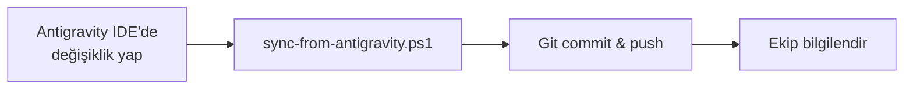
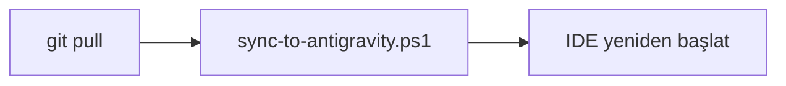

# 🚀 HAVSAN Antigravity Konfigürasyon Yönetimi

**Versiyon:** 1.0.0  
**Proje Amacı:** HAVSAN ekibi için Antigravity IDE konfigürasyonlarını merkezi Git repository'den yönetmek ve dağıtmak.

---

## 📦 Proje Yapısı

```
havsan-ai-coding-mimari-app/
├── HAVSAN-ANTIGRAVITY/              # 📦 Dağıtım Paketi (Ekibe verilecek)
│   ├── README.md                    # Paket tanıtımı
│   ├── KURULUM.md                   # Kurulum rehberi
│   ├── GEMINI.md                    # Global Rules
│   ├── screenshots/                 # Dokümantasyon görselleri
│   └── antigravity/
│       ├── skills/                  # Özel yetenekler
│       │   ├── havsan-appsscript/
│       │   ├── havsan-code-review/
│       │   └── havsan-development/
│       └── workflows/               # İş akışları
│           ├── analist.md
│           ├── backend-architect.md
│           └── frontend-design.md
│
├── config/                          # 🔧 Kaynak Konfigürasyonlar
│   └── GEMINI.md
│
├── skills/                          # Kaynak Skills
├── workflows/                       # Kaynak Workflows
│
├── scripts/                         # 🛠️ Yönetim Scriptleri
│   ├── sync-to-antigravity.ps1     # Proje → Antigravity
│   ├── sync-from-antigravity.ps1   # Antigravity → Proje
│   ├── validate-config.ps1         # Doğrulama
│   └── install-team.ps1            # Ekip kurulumu
│
├── docs/                            # 📚 Dokümantasyon
│   ├── screenshots/
│   └── SORUN_GIDERME.md
│
├── CHANGELOG.md                     # Versiyon geçmişi
├── .gitignore
└── README.md                        # Bu dosya
```

---

## 🎯 Kullanım Senaryoları

### 1️⃣ Atıf (Yönetici) - Konfigürasyon Güncelleme

```powershell
# 1. Antigravity IDE'de GEMINI.md veya Skills'i düzenle

# 2. Değişiklikleri projeye çek
.\scripts\sync-from-antigravity.ps1

# 3. Git commit
git add .
git commit -m "feat: Add new Docker-first rule"
git push

# 4. Ekip üyelerine duyur
```

### 2️⃣ Ekip Üyesi - İlk Kurulum

**Basit Yöntem (Önerilen):**

1. `HAVSAN-ANTIGRAVITY` klasörünü al
2. İçeriğini `C:\Users\<KULLANICI_ADIN>\.gemini\` altına kopyala
3. Antigravity IDE'yi yeniden başlat

**Script ile:**

```powershell
cd C:\Repos\HAVSAN\havsan-ai-coding-mimari-app
.\scripts\install-team.ps1
```

### 3️⃣ Ekip Üyesi - Güncelleme Alma

```powershell
# 1. Git'ten güncellemeleri çek
git pull

# 2. Antigravity'ye uygula
.\scripts\sync-to-antigravity.ps1
```

---

## 🔧 Script Referansı

### sync-to-antigravity.ps1

**Amaç:** Proje dosyalarını Antigravity klasörüne kopyalar.

**Kullanım:**
```powershell
.\scripts\sync-to-antigravity.ps1           # Normal mod
.\scripts\sync-to-antigravity.ps1 -DryRun   # Test modu (değişiklik yapmaz)
.\scripts\sync-to-antigravity.ps1 -Force    # Yedekleme olmadan
```

**Özellikler:**
- ✅ Otomatik yedekleme (timestamp ile)
- ✅ MD5 hash doğrulama
- ✅ Renkli konsol çıktısı

---

### sync-from-antigravity.ps1

**Amaç:** Antigravity'deki değişiklikleri projeye çeker.

**Kullanım:**
```powershell
.\scripts\sync-from-antigravity.ps1                    # Normal mod
.\scripts\sync-from-antigravity.ps1 -AutoCommit        # Otomatik Git commit
.\scripts\sync-from-antigravity.ps1 -DryRun            # Test modu
```

**Özellikler:**
- ✅ Değişiklik tespiti (MD5 hash)
- ✅ Git status kontrolü
- ✅ Otomatik commit özelliği

---

### validate-config.ps1

**Amaç:** Konfigürasyon dosyalarını doğrular.

**Kullanım:**
```powershell
.\scripts\validate-config.ps1           # Normal mod
.\scripts\validate-config.ps1 -Verbose  # Detaylı çıktı
```

**Kontroller:**
- ✅ YAML frontmatter formatı
- ✅ Zorunlu bölümler (GEMINI.md)
- ✅ Dosya bütünlüğü

---

### install-team.ps1

**Amaç:** Yeni ekip üyesi için ilk kurulum.

**Kullanım:**
```powershell
.\scripts\install-team.ps1         # Normal mod
.\scripts\install-team.ps1 -Force  # Yedekleme olmadan
```

**Adımlar:**
1. Antigravity IDE kontrolü
2. Mevcut konfigürasyonları yedekleme
3. Doğrulama
4. Senkronizasyon
5. Final kontroller

---

## 📋 Konfigürasyon İçeriği

### 🛡️ GEMINI.md - Global Rules

HAVSAN'ın temel yazılım geliştirme prensipleri:

1. **Dil ve İletişim:** %100 Türkçe, eğitmen modu
2. **Docker-First:** Local kurulum yasak, tüm süreçler Docker ile
3. **Frontend-First:** Analiz → Frontend → Backend
4. **Güvenli Otonom Çalışma:** Kritik işlemlerde onay
5. **Teknoloji Tercihleri:** Google → HAVSAN Cloud → Open Source
6. **Proje Hafızası:** `.agent/rules/` ile kalıcı tercihler
7. **İteratif Analiz:** `analiz_master.md` ile derinlemesine analiz

### 🎯 Skills

- **havsan-appsscript:** Google Apps Script + Dockerized Clasp
- **havsan-code-review:** HAVSAN standartlarına göre kod incelemesi
- **havsan-development:** Yeni proje başlatma protokolü (ZORUNLU)

### ⚙️ Workflows

- **analist:** İteratif analiz uzmanı (`/analist`)
- **backend-architect:** Backend mimari tasarım (`/backend-architect`)
- **frontend-design:** Frontend tasarım (`/frontend-design`)

---

## 🔄 Geliştirme Workflow'u

### Atıf'ın Workflow'u



### Ekip Üyesinin Workflow'u



---

## 🚀 Hızlı Başlangıç

### Yeni Ekip Üyesi

```powershell
# 1. Projeyi klonla
git clone <repo-url> C:\Repos\HAVSAN\havsan-ai-coding-mimari-app
cd C:\Repos\HAVSAN\havsan-ai-coding-mimari-app

# 2. Kurulum yap
.\scripts\install-team.ps1

# 3. IDE'yi yeniden başlat
```

### Atıf - Konfigürasyon Güncelleme

```powershell
# 1. IDE'de değişiklik yap

# 2. Projeye çek
.\scripts\sync-from-antigravity.ps1 -AutoCommit

# 3. Push et
git push
```

---

## 📚 Dokümantasyon

- **[HAVSAN-ANTIGRAVITY/README.md](HAVSAN-ANTIGRAVITY/README.md)** - Dağıtım paketi tanıtımı
- **[HAVSAN-ANTIGRAVITY/KURULUM.md](HAVSAN-ANTIGRAVITY/KURULUM.md)** - Detaylı kurulum rehberi
- **[CHANGELOG.md](CHANGELOG.md)** - Versiyon geçmişi

---

## ❓ Sık Sorulan Sorular

### Neden tek klasör yaklaşımı?

**Basitlik.** Ekip üyeleri `HAVSAN-ANTIGRAVITY` klasörünü alıp doğrudan `.gemini` altına kopyalayabilir. Script bilgisi gerektirmez.

### Git neden gerekli?

**Versiyon kontrolü.** Konfigürasyon değişikliklerini takip etmek, geri almak ve ekiple paylaşmak için.

### Scriptler zorunlu mu?

**Hayır.** Manuel kopyala-yapıştır da çalışır. Scriptler sadece otomasyonu kolaylaştırır.

### Mevcut konfigürasyonlarım ne olur?

**Korunur.** Klasör birleştirme yapılır. Sadece HAVSAN dosyalarıyla aynı isimdeki dosyalar üzerine yazılır.

---

## 🆘 Destek

- **Atıf Ertuğrul Kan:** atifertugrul.kan@havsanrobotik.com.tr
- **Slack:** `#antigravity-destek`

---

## 📄 Lisans

© 2026 HAVSAN Robotik - Dahili Kullanım

---

**🎯 Misyon:** Tüm HAVSAN ekibinin aynı standartlarda, profesyonel ve verimli AI-assisted coding yapması!
