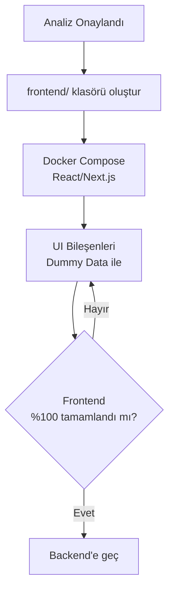
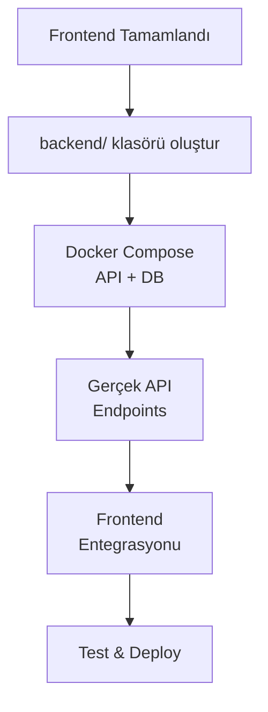

# 🚀 HAVSAN Antigravity Konfigürasyon Yönetimi

**Versiyon:** 1.0.0  
**Amaç:** HAVSAN ekibi için standart Antigravity IDE konfigürasyonları

---

## 📦 Ne İçeriyor?

```
gemini/                         # Dağıtım Paketi
└── antigravity/
    ├── skills/                 # 3 özel yetenek
    └── workflows/              # 3 iş akışı
```

**Not:** `GEMINI.md` ve `KURULUM.md` dosyaları **global** olarak `C:\Users\<USERNAME>\.gemini\` altında bulunur.

---

## ⚡ Hızlı Kurulum

### Ekip Üyesi

1. `gemini/antigravity/` klasörünü kopyala
2. `C:\Users\<KULLANICI_ADIN>\.gemini\antigravity\` altına yapıştır
3. Antigravity IDE'yi yeniden başlat

**Global Dosyalar:** `GEMINI.md` ve `KURULUM.md` Atıf tarafından paylaşılır.

### Atıf (Yönetici)

**Konfigürasyon Güncelleme:**
```powershell
# 1. C:\Users\HP\.gemini\ altındaki dosyaları düzenle
# 2. Hızlı güncelleme
.\scripts\guncelle.ps1
# 3. Git commit
git add .
git commit -m "feat: Update configurations"
git push
```

---

## 🛡️ HAVSAN Standartları

### 7 Temel Kural

1. **%100 Türkçe** iletişim
2. **Docker-First** (local kurulum yasak)
3. **Frontend-First** (Analiz → Frontend → Backend)
4. **İteratif Analiz** (`analiz_master.md`)
5. **Güvenli Otonom Çalışma** (kritik işlemlerde onay)
6. **Teknoloji Hiyerarşisi** (Google → HAVSAN Cloud → Open Source)
7. **Proje Hafızası** (`.agent/rules/`)

### Git Kontrol (ZORUNLU)

- ❌ `git commit` - SafeToAutoRun: **false** (ONAY GEREKLİ)
- ❌ `git push` - SafeToAutoRun: **false** (ONAY GEREKLİ)
- ✅ `git status/diff/log` - Serbest

### Skills

- **havsan-appsscript** - Google Apps Script + Dockerized Clasp
- **havsan-code-review** - Kod inceleme standartları
- **havsan-development** - Yeni proje protokolü (ZORUNLU)

### Workflows

- `/analist` - İteratif analiz
- `/backend-architect` - Backend tasarım
- `/frontend-design` - Frontend tasarım

---

## 🎯 Fullstack Geliştirme Yol Haritası

### Faz 1: Analiz (ZORUNLU)

```mermaid
graph TD
    %% Faz 1: Analiz
    subgraph "Faz 1: Analiz (ZORUNLU)"
        Start[Yeni Proje Talebi] --> Init[analiz_master.md oluştur]
        Init --> Loop{İteratif Sorular<br/>5-10 Round}
        Loop -- Hayır --> Q[Soruları Cevapla]
        Q --> Loop
        Loop -- Evet --> PRD[gereksinim_analizi.md]
        
        note right of PRD
            Tek Doğruluk Kaynağı
            (Kopyalanmaz, Referans Verilir)
        end
    end

    %% Faz 2: Frontend
    subgraph "Faz 2: Frontend (Dummy Data)"
        PRD --> FE_Init[Frontend Projesi Başlat]
        FE_Init --> FE_Dev[UI Geliştirme<br/>(Hardcoded Data)]
        FE_Dev --> FE_Rev{Kullanıcı Onayı}
        FE_Rev -- Red --> FE_Dev
    end

    %% Faz 3: Backend
    subgraph "Faz 3: Backend & Entegrasyon"
        FE_Rev -- Onay --> BE_Init[Backend Projesi Başlat]
        BE_Init --> BE_Dev[API & DB Geliştirme]
        BE_Dev --> Integ[Frontend <-> Backend Bağlantısı]
        Integ --> Test[E2E Testler]
    end

    %% Deployment
    subgraph "Faz 4: Canlıya Geçiş"
        Test --> Deploy[Production Deploy]
    end
```

**Kurallar:**
- ❌ `frontend/` veya `backend/` klasörü **AÇILMAZ**
- ✅ Tek dosya: `docs/analiz_master.md`
- ✅ Checkbox takip: `- [ ]` → `- [x]`
- ✅ IDE yorumları: `<!-- YANIT: ... -->`

### Faz 2: Frontend (Dummy Data)



**Kurallar:**
- ✅ `docker-compose.yml` ile izole ortam
- ✅ %100 dummy data (mock API)
- ❌ Backend'e **DOKUNULMAZ**

### Faz 3: Backend (Gerçek Veri)



**Kurallar:**
- ✅ Frontend ile aynı `docker-compose.yml`
- ✅ PostgreSQL/MongoDB container
- ✅ API dokümantasyonu

---

## 📂 Proje Klasör Yapısı

### Analiz Aşaması

```
proje-adi/
├── .agent/
│   └── rules/
├── docs/
│   └── analiz_master.md        ← Tek dosya
└── docker-compose.yml          ← Henüz yok
```

### Frontend Aşaması

```
proje-adi/
├── docs/
│   ├── analiz_master.md
│   └── gereksinim_analizi.md   ← Onaylanmış analiz
├── frontend/
│   ├── src/
│   ├── public/
│   └── Dockerfile
├── docker-compose.yml          ← Frontend container
└── .gitignore
```

### Backend Aşaması

```
proje-adi/
├── docs/
├── frontend/
├── backend/
│   ├── src/
│   ├── tests/
│   └── Dockerfile
├── docker-compose.yml          ← Frontend + Backend + DB
└── README.md
```

---

## 🔧 Yönetim Scriptleri

| Script | Amaç |
|--------|------|
| `guncelle.ps1` | Proje → .gemini otomatik senkronizasyon |

**Kullanım:**
```powershell
.\scripts\guncelle.ps1
```

---

## ⚙️ IDE Ayarları (ÖNEMLİ)

Git kontrol kurallarının çalışması için IDE ayarlarını değiştir:

### Antigravity IDE → Settings

1. **Auto Execution:** `Always Proceed` → `Ask`
2. **Review Policy:** `Always Proceed` → `Ask`

Bu ayarlar, IDE'nin Git commit/push için **mutlaka onay istemesini** sağlar.

---

## 📚 Dokümantasyon

- **[C:\Users\HP\.gemini\GEMINI.md](file:///C:/Users/HP/.gemini/GEMINI.md)** - Global Rules
- **[C:\Users\HP\.gemini\KURULUM.md](file:///C:/Users/HP/.gemini/KURULUM.md)** - Kurulum + Proje Başlatma
- **[scripts/README.md](scripts/README.md)** - Script kullanım rehberi

---

## 🆘 Destek

- **Atıf Ertuğrul Kan:** atifertugrul.kan@havsanrobotik.com.tr
- **Slack:** `#antigravity-destek`

---

**🎯 Misyon:** Tüm HAVSAN ekibinin aynı standartlarda, profesyonel AI-assisted coding yapması!
