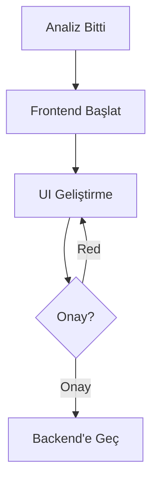
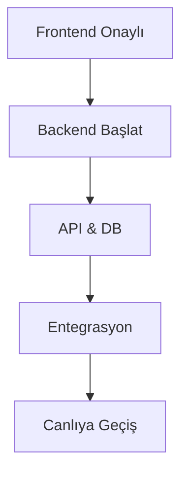

# 🚀 HAVSAN Antigravity

**Versiyon:** 2.0.0 (Unified & Simplified)
**Amaç:** HAVSAN Yapay Zeka & Robotik ekibi için standart geliştirme ortamı.

---

## ⚡ 10 Saniyede Kurulum

**Tek Adım:** 
`scripts/antigravity-kurulum.ps1` dosyasına **Sağ Tık -> Run with PowerShell**

*(Bu işlem tüm kuralları yükler ve günceller)*

---

## 🎯 Fullstack Geliştirme Haritası

### Faz 1: Analiz (ZORUNLU)

> **Kural:** `docs/analiz_master.md` tek doğruluk kaynağıdır. Kopyalanmaz!

```mermaid
graph TD
    Start[Yeni Proje] --> Init[analiz_master.md]
    Init --> Loop{İteratif Sorular}
    Loop -- Hayır --> Q[Cevapla]
    Q --> Loop
    Loop -- Evet --> PRD[gereksinim_analizi.md]
    
    note right of PRD
        Tek Kaynak
        (Kopyalamak YASAK)
    end
```

### Faz 2: Frontend (Dummy Data)

> **Kural:** Backend yokmuş gibi çalış. %100 Mock Data.



### Faz 3: Backend & Entegrasyon

> **Kural:** Frontend onayı almadan Backend yazılmaz.



---

## 🛡️ 7 Altın Kural

1. **%100 Türkçe** 🇹🇷
2. **Docker-First** (Local yasak) 🐳
3. **Frontend-First** (Önce UI) 🎨
4. **İteratif Analiz** (`analiz_master.md`) 📝
5. **Onaylı Git** (Commit yasak, onay şart) 🛑
6. **Teknoloji:** Google > HAVSAN > Open Source ☁️
7. **Hafıza:** Kuralları `.agent/rules/` içine yaz 🧠

---

## ⚙️ IDE Ayarı (Bunu Yapmazsan Çalışmaz!)

Antigravity IDE sağ üstten **Settings**:
1. **Auto Execution:** `Ask` (Always Proceed YAPMA)
2. **Review Policy:** `Ask` (Always Proceed YAPMA)

---

## 📂 Klasör Yapısı

```
proje/
├── docs/               # Analiz (TEK KAYNAK)
├── frontend/           # React/Next.js
├── backend/            # FastAPI/Node.js
└── docker-compose.yml  # Tüm sistem
```
