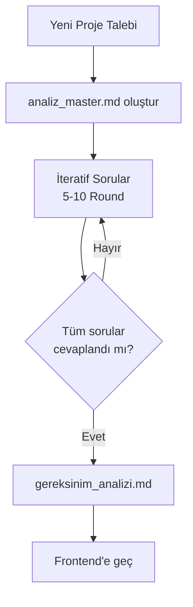
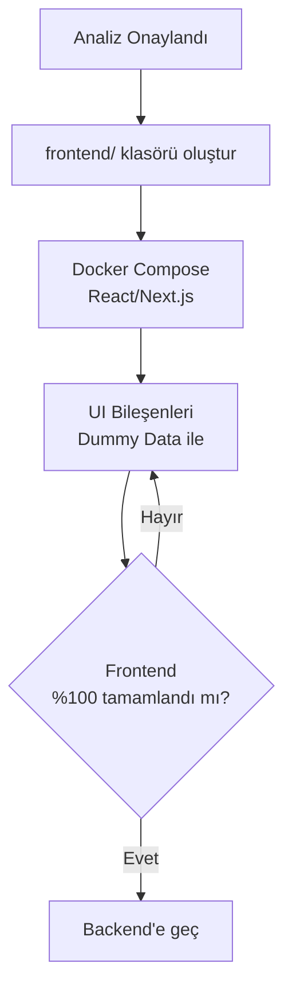
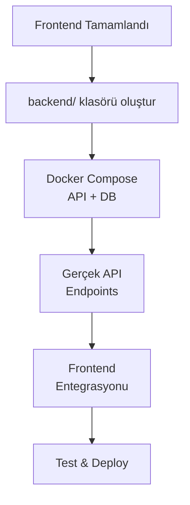

# 🚀 HAVSAN Antigravity Konfigürasyon Yönetimi

**Versiyon:** 1.0.0  
**Amaç:** HAVSAN ekibi için standart Antigravity IDE konfigürasyonları

---

## 📦 Ne İçeriyor?

```
gemini/                         # Dağıtım Paketi
├── GEMINI.md                   # Global Rules
├── KURULUM.md                  # Kurulum + Proje Başlatma
└── antigravity/
    ├── skills/                 # 3 özel yetenek
    └── workflows/              # 3 iş akışı
```

---

## ⚡ Hızlı Kurulum

### Ekip Üyesi

1. `gemini` klasörünün **içeriğini** kopyala
2. `C:\Users\<KULLANICI_ADIN>\.gemini\` altına yapıştır
3. Antigravity IDE'yi yeniden başlat

**Detay:** `gemini/KURULUM.md`

### Atıf (Yönetici)

```powershell
# Değişiklik sonrası
.\scripts\sync-from-antigravity.ps1 -AutoCommit
git push
```

---

## 🛡️ HAVSAN Standartları

### 7 Temel Kural

1. **%100 Türkçe** iletişim
2. **Docker-First** (local kurulum yasak)
3. **Frontend-First** (Analiz → Frontend → Backend)
4. **İteratif Analiz** (`analiz_master.md`)
5. **Güvenli Otonom Çalışma** (kritik işlemlerde onay)
6. **Teknoloji Hiyerarşisi** (Google → HAVSAN Cloud → Open Source)
7. **Proje Hafızası** (`.agent/rules/`)

### Skills

- **havsan-appsscript** - Google Apps Script + Dockerized Clasp
- **havsan-code-review** - Kod inceleme standartları
- **havsan-development** - Yeni proje protokolü (ZORUNLU)

### Workflows

- `/analist` - İteratif analiz
- `/backend-architect` - Backend tasarım
- `/frontend-design` - Frontend tasarım

---

## 🎯 Fullstack Geliştirme Yol Haritası

### Faz 1: Analiz (ZORUNLU)



**Kurallar:**
- ❌ `frontend/` veya `backend/` klasörü **AÇILMAZ**
- ✅ Tek dosya: `docs/analiz_master.md`
- ✅ Checkbox takip: `- [ ]` → `- [x]`
- ✅ IDE yorumları: `<!-- YANIT: ... -->`

### Faz 2: Frontend (Dummy Data)



**Kurallar:**
- ✅ `docker-compose.yml` ile izole ortam
- ✅ %100 dummy data (mock API)
- ❌ Backend'e **DOKUNULMAZ**

### Faz 3: Backend (Gerçek Veri)



**Kurallar:**
- ✅ Frontend ile aynı `docker-compose.yml`
- ✅ PostgreSQL/MongoDB container
- ✅ API dokümantasyonu

---

## 📂 Proje Klasör Yapısı

### Analiz Aşaması

```
proje-adi/
├── .agent/
│   └── rules/
├── docs/
│   └── analiz_master.md        ← Tek dosya
└── docker-compose.yml          ← Henüz yok
```

### Frontend Aşaması

```
proje-adi/
├── docs/
│   ├── analiz_master.md
│   └── gereksinim_analizi.md   ← Onaylanmış analiz
├── frontend/
│   ├── src/
│   ├── public/
│   └── Dockerfile
├── docker-compose.yml          ← Frontend container
└── .gitignore
```

### Backend Aşaması

```
proje-adi/
├── docs/
├── frontend/
├── backend/
│   ├── src/
│   ├── tests/
│   └── Dockerfile
├── docker-compose.yml          ← Frontend + Backend + DB
└── README.md
```

---

## 🔧 Yönetim Scriptleri

| Script | Amaç |
|--------|------|
| `sync-to-antigravity.ps1` | Proje → Antigravity |
| `sync-from-antigravity.ps1` | Antigravity → Proje |
| `validate-config.ps1` | Doğrulama |
| `install-team.ps1` | Ekip kurulumu |

---

## 📚 Dokümantasyon

- **[gemini/KURULUM.md](gemini/KURULUM.md)** - Kurulum + Proje Başlatma
- **[CHANGELOG.md](CHANGELOG.md)** - Versiyon geçmişi

---

## 🆘 Destek

- **Atıf Ertuğrul Kan:** atifertugrul.kan@havsanrobotik.com.tr
- **Slack:** `#antigravity-destek`

---

**🎯 Misyon:** Tüm HAVSAN ekibinin aynı standartlarda, profesyonel AI-assisted coding yapması!
