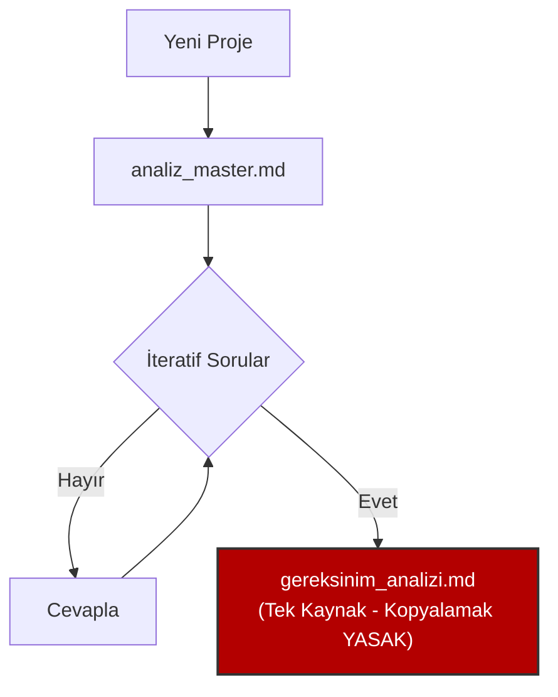
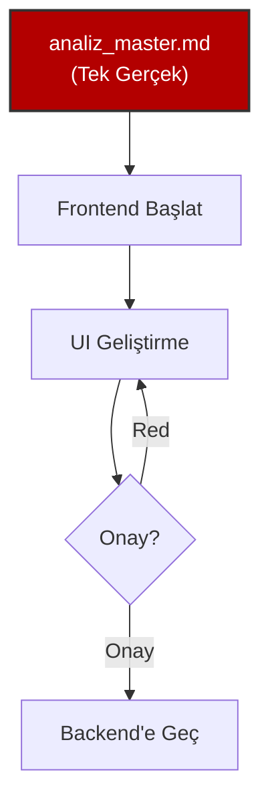
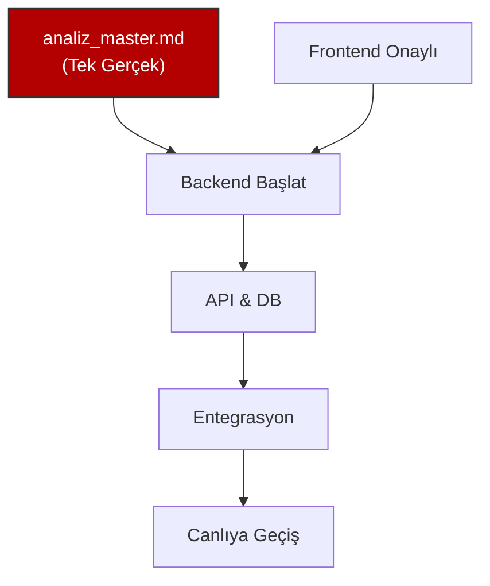

```text
  _   _    _ __     __ ___    _    _   _ 
 | | | |  / \\ \   / // __|  / \  | \ | |
 | |_| | / _ \\ \ / / \__ \ / _ \ |  \| |
 |  _  |/ ___ \\ V /  |___// ___ \| |\  |
 |_| |_/_/   \_\\_/   |___/_/   \_\_| \_| Robotics & AI | ELAZIG ORGANIZE SANAYI BOLGESI
                                         
```

# 🚀 HAVSAN Antigravity

**Versiyon:** 2.6.4 (Shortcut Fix)
**Amaç:** HAVSAN Yapay Zeka & Robotik ekibi için standart geliştirme ortamı.

---

## ⚡ 10 Saniyede Kurulum & Güncelleme

### İlk Kurulum
1. `scripts/antigravity-kurulum.ps1` dosyasına **Sağ Tık -> Run with PowerShell**


### Atıf Yeni Kural Eklediğinde? (Güncelleme)
1. `scripts/antigravity-kurulum.ps1` çalıştır.
2. Script kimle çalıştığına bakar:
   - **ATIF ise:** Değişiklikleri Git'e gönderir (**Push**).
   - **Diğerleri ise:** Değişiklikleri çeker (**Pull**).
3. Bitti! ✅

---

## 🔄 Nasıl Çalışır? (Akıllı Senkronizasyon)

**Merkezi Kural Yönetimi:** Kendi (ATIF) kök kurallarını değiştirdiğinde, bu değişikliklerin tüm ekibi etkilemesi için bir proje geliştirildi.

**Akıllı Script Mantığı:** `antigravity-kurulum.ps1` dosyası çalıştırıldığında kullanıcıyı ayırt eder:

1.  **Eğer kullanıcı "ATIF" ise:**
    *   Yerelindeki güncel kök kurallarını okur.
    *   Git üzerine gönderir (Auto-Push).
2.  **Eğer kullanıcı başka bir yazılımcı ise:**
    *   Git üzerindeki güncel kuralları çeker (Auto-Pull).
    *   Yerel sisteme entegre eder.

**Mimari Güncelleme:** `mimari-app` üzerinde bir geliştirme yapıldığında, PowerShell dosyası da otomatik olarak güncellenip Git'e aktarılır.

---

## 🎯 Fullstack Geliştirme Haritası

### Faz 1: Analiz (ZORUNLU)

> **Kural:** `docs/analiz_master.md` tek doğruluk kaynağıdır. Kopyalanmaz!



### Faz 2: Frontend (Dummy Data)

> **Kural:** Backend yokmuş gibi çalış. %100 Mock Data.



### Faz 3: Backend & Entegrasyon

> **Kural:** Frontend onayı almadan Backend yazılmaz.



---

## 🛡️ 7 Altın Kural

1. **%100 Türkçe** 🇹🇷
2. **Docker-First** (Local yasak) 🐳
3. **Frontend-First** (Önce UI) 🎨
4. **İteratif Analiz** (`analiz_master.md`) 📝
5. **Onaylı Git** (Commit yasak, onay şart) 🛑
6. **Teknoloji:** Google > HAVSAN > Open Source ☁️
7. **Hafıza:** Kuralları `.agent/rules/` içine yaz 🧠

---

## ⚙️ IDE Ayarı (Bunu Yapmazsan Çalışmaz!)

Antigravity IDE sağ üstten **Settings**:
1. **Auto Execution:** `Ask` (Always Proceed YAPMA)
2. **Review Policy:** `Ask` (Always Proceed YAPMA)

---

## 📂 Klasör Yapısı

```
proje/
├── docs/               # Analiz (TEK KAYNAK)
├── frontend/           # React/Next.js
├── backend/            # FastAPI/Node.js
└── docker-compose.yml  # Tüm sistem
```
