```text
  _   _    _ __     __ ___    _    _   _ 
 | | | |  / \\ \   / // __|  / \  | \ | |
 | |_| | / _ \\ \ / / \__ \ / _ \ |  \| |
 |  _  |/ ___ \\ V /  |___// ___ \| |\  |
 |_| |_/_/   \_\\_/   |___/_/   \_\_| \_| Robotics & AI | ELAZIG ORGANIZE SANAYI BOLGESI
                                         
```

# 🚀 HAVSAN Antigravity

**Versiyon:** 2.6.6 (Stable)
**Amaç:** HAVSAN Yapay Zeka & Robotik ekibi için standart geliştirme ortamı.

---

## ⚡ 10 Saniyede Kurulum & Güncelleme

1. `antigravity-kurulum.bat` dosyasına **Çift Tıkla**
2. Bitti! ✅

---

## 🔄 Otomatik Güncelleme Sistemi

### Nasıl Çalışır?

Script, **ilk kurulumda** Windows Startup klasörüne otomatik olarak eklenir:

```
C:\Users\[Kullanıcı]\AppData\Roaming\Microsoft\Windows\Start Menu\Programs\Startup\
└── Antigravity-Startup.lnk
```

**Her bilgisayar açılışında:**
1. ⏱️ 30 saniye bekler (Windows ağ bağlantısı için)
2. 🌐 İnternet bağlantısını kontrol eder (8.8.8.8'e ping)
   - ❌ Bağlantı yoksa: 10 saniye aralıklarla 6 kez dener (toplam 90 saniye)
   - ❌ Hala yoksa: Sessizce kapanır
3. 🔄 **Kendi Güncellemesi:** Git'ten proje güncellemelerini çeker (script dahil)
4. 🔁 **Yeni versiyon varsa:** Script'i yeniden başlatır (güncel versiyon çalışır)
5. 📁 Dosyaları `%USERPROFILE%\.gemini` klasörüne kopyalar
6. 🎯 Sessizce kapanır

**Kullanıcı deneyimi:** Hiçbir şey görmezsiniz, arka planda otomatik güncellenir! 🚀

---

## 🔐 Akıllı Senkronizasyon (Admin vs Developer)

Script, Git kullanıcı adına bakarak otomatik karar verir:

| Kullanıcı | Davranış |
|-----------|----------|
| **Atif** (Admin) | `git push` - Değişiklikleri gönderir |
| **Diğerleri** (Developer) | `git pull` - Değişiklikleri çeker |

**Sonuç:** Atif yeni bir kural eklediğinde, tüm ekip üyeleri otomatik olarak güncellenir! ✨

---

## 📂 Dosya Yapısı

```
havsan-ai-coding-mimari-app/
├── antigravity-kurulum.bat          # Wrapper (Çift tıkla)
├── script/
│   └── antigravity-kurulum.ps1      # Ana PowerShell script
├── gemini/
│   ├── GEMINI.dist.md               # Global kurallar (→ %USERPROFILE%\.gemini\GEMINI.md)
│   ├── KURULUM.md                   # Kurulum rehberi
│   └── antigravity/
│       ├── skills/                  # Yetenekler (havsan-appsscript, vb.)
│       └── workflows/               # İş akışları (analist, backend-architect, vb.)
└── README.md                        # Bu dosya
```

---

## 🛠️ Teknik Detaylar

### Özellikler
- ✅ UTF-8 karakter desteği (Türkçe ve Emoji)
- ✅ Otomatik PowerShell versiyonu kontrolü
- ✅ İnternet bağlantısı kontrolü (sadece startup'ta)
- ✅ Akıllı Git senkronizasyonu (Admin Push / Dev Pull)
- ✅ Otomatik yedekleme (`%USERPROFILE%\.gemini\backups\`)
- ✅ IDE otomatik açılma (Antigravity kısayolu)
- ✅ TopMost popup bildirimi (IDE üstünde kalır)
- ✅ Tam ekran konsol (180x100)

### Güncellenen Dosyalar
Script çalıştığında şu dosyalar güncellenir:

```
C:\Users\[Kullanıcı]\.gemini\
├── GEMINI.md              # Global kurallar
├── KURULUM.md             # Kurulum rehberi
└── antigravity\
    ├── skills\            # Yetenekler
    └── workflows\         # İş akışları
```

---

## 🐛 Sorun Giderme

### "Kaynak yok" Hatası
- **Neden:** Script `script/` klasöründe değil
- **Çözüm:** `antigravity-kurulum.bat` dosyasını kullanın (otomatik düzeltir)

### Versiyon Uyumsuzluğu (IDE'de eski versiyon görünüyor)
- **Neden:** Lokal `.gemini` klasörü güncel değil
- **Çözüm:** Script'i bir kez daha çalıştırın, sonra IDE'de "Refresh Rules" yapın

### İnternet Bağlantısı Yok
- **Otomatik Başlangıç:** 90 saniye bekler, sonra kapanır (sessiz)
- **Manuel Çalıştırma:** Git güncellemesi yapamaz ama mevcut dosyalarla çalışır

---

## 📝 Changelog

### v2.6.6 (Stable)
- ✅ İnternet bağlantısı kontrolü (startup'ta)
- ✅ Script `script/` klasörüne taşındı
- ✅ Popup TopMost (IDE üstünde kalır)
- ✅ Konsol boyutu optimize edildi (180x100)
- ✅ Path hesaplama düzeltildi

### v2.6.5
- ✅ UTF-8 karakter desteği
- ✅ Akıllı senkronizasyon (Admin Push / Dev Pull)

### v2.6.4
- ✅ Antigravity IDE kısayolu düzeltildi

---

## 📞 Destek

**Geliştirici:** Atif Ertugrul Kan  
**Rol:** Kurumsal Geliştirici Altyapı Mimarı & HAVSAN CTO  
**Organizasyon:** HAVSAN Robotics & AI | Elazığ Organize Sanayi Bölgesi

---

## 🛡️ Güvenlik ve Yönetişim (Public Repo Policy)

**"Başkaları projemi bozabilir mi?"**
Hayır. Bu depo **Public (Halka Açık)** olsa da, **Write (Yazma/Commit)** yetkileri sıkı bir şekilde korunmaktadır.

1.  **Yetki (Authorization):** Sadece proje sahibi (**Atıf**) ve yetkilendirilmiş Collaborator'lar `main` dalına doğrudan kod gönderebilir (Push).
2.  **Dış Katkı (Community):** Dışarıdan (veya yetkisiz) geliştiriciler projeyi yalnızca **Clone** edebilir veya **Fork**'layabilir.
3.  **Değişiklik Talebi:** Eğer bir başkası değişiklik yapmak isterse, **Pull Request (PR)** açmak zorundadır. Bu talepler, yönetici onayı olmadan projeye dahil edilemez.

> **Özet:** Kodlarınız halka açıktır (okunabilir), ancak kontrol tamamen sizdedir (değiştirilemez).

---

## 🎯 Fullstack Geliştirme Haritası

### Faz 1: Analiz (ZORUNLU)

> **Kural:** `docs/analiz_master.md` tek doğruluk kaynağıdır. Kopyalanmaz!


### Faz 2: Frontend (Dummy Data)

> **Kural:** Backend yokmuş gibi çalış. %100 Mock Data.

```mermaid
graph TD
    Analiz["analiz_master.md<br/>(Tek Gerçek)"] --> FE[Frontend Başlat]
    FE --> Dev[UI Geliştirme]
    Dev --> Rev{Onay?}
    Rev -- Red --> Dev
    Rev -- Onay --> Next[Backend'e Geç]
    
    style Analiz fill:#b30000,stroke:#333,stroke-width:2px,color:#fff
```



### Faz 3: Backend & Entegrasyon

> **Kural:** Frontend onayı almadan Backend yazılmaz.

```mermaid
graph TD
    Analiz["analiz_master.md<br/>(Tek Gerçek)"] --> BE[Backend Başlat]
    FE_OK[Frontend Onaylı] --> BE
    BE --> API[API & DB]
    API --> Integ[Entegrasyon]
    Integ --> Live[Canlıya Geçiş]
    
    style Analiz fill:#b30000,stroke:#333,stroke-width:2px,color:#fff
```



---

## 🛡️ 7 Altın Kural

1. **%100 Türkçe** 🇹🇷
2. **Docker-First** (Local yasak) 🐳
3. **Frontend-First** (Önce UI) 🎨
4. **İteratif Analiz** (`analiz_master.md`) 📝
5. **Onaylı Git** (Commit yasak, onay şart) 🛑
6. **Teknoloji:** Google > HAVSAN > Open Source ☁️
7. **Hafıza:** Kuralları `.agent/rules/` içine yaz 🧠

---

## ⚙️ IDE Ayarı (Bunu Yapmazsan Çalışmaz!)

Antigravity IDE sağ üstten **Settings**:
1. **Auto Execution:** `Ask` (Always Proceed YAPMA)
2. **Review Policy:** `Ask` (Always Proceed YAPMA)

---

## 📂 Klasör Yapısı

```
proje/
├── docs/               # Analiz (TEK KAYNAK)
├── frontend/           # React/Next.js
├── backend/            # FastAPI/Node.js
└── docker-compose.yml  # Tüm sistem
```
