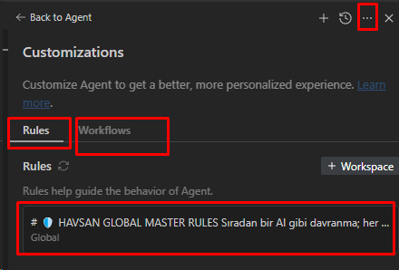
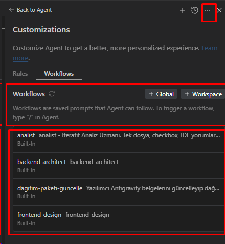

# 📖 HAVSAN Antigravity Kurulum Rehberi

**Hedef Kitle:** HAVSAN Yazılım Ekibi  
**Tahmini Süre:** 5 dakika  
**Zorluk:** Başlangıç

---

## 🎯 Kurulum Öncesi

### Gereksinimler

- ✅ **Google Antigravity IDE** kurulu olmalı
- ✅ **Windows** işletim sistemi
- ✅ **Yönetici yetkisi** (bazı durumlarda)

### Antigravity IDE Kurulumu

Eğer henüz Antigravity IDE kurulu değilse:

1. [Google Antigravity IDE](https://ide.google.com) adresine git
2. İndir ve kur
3. **En az bir kez çalıştır** (`.gemini` klasörü oluşması için)
4. IDE'yi kapat

---

## 📦 Kurulum Yöntemleri

### Yöntem 1: Manuel Kurulum (Önerilen - Basit)

#### Adım 1: Klasör Konumunu Bul

Windows Gezgini'nde şu adrese git:

```
C:\Users\<KULLANICI_ADIN>\.gemini\
```

**İpucu:** `<KULLANICI_ADIN>` yerine kendi kullanıcı adınızı yazın.

**Hızlı Erişim:**
1. `Win + R` tuşlarına bas
2. `%USERPROFILE%\.gemini` yaz
3. Enter'a bas

#### Adım 2: HAVSAN-ANTIGRAVITY İçeriğini Kopyala

1. Bu paketteki **`HAVSAN-ANTIGRAVITY`** klasörünü aç
2. **İçindeki tüm dosya ve klasörleri seç** (Ctrl+A)
3. **Kopyala** (Ctrl+C)

#### Adım 3: .gemini Klasörüne Yapıştır

1. `.gemini` klasörüne git
2. **Yapıştır** (Ctrl+V)
3. Eğer "Dosyalar zaten var, değiştir mi?" sorusu gelirse:
   - ✅ **"Evet, değiştir"** veya **"Birleştir"** seçin

#### Adım 4: Sonuç Kontrolü

`.gemini` klasörü şu şekilde görünmeli:

```
C:\Users\<KULLANICI_ADIN>\.gemini\
├── GEMINI.md                    ← YENİ
├── antigravity\
│   ├── skills\
│   │   ├── havsan-appsscript\   ← YENİ
│   │   ├── havsan-code-review\  ← YENİ
│   │   └── havsan-development\  ← YENİ
│   └── workflows\
│       ├── analist.md           ← YENİ
│       ├── backend-architect.md ← YENİ
│       └── frontend-design.md   ← YENİ
└── (diğer mevcut dosyalar)
```

#### Adım 5: IDE'yi Yeniden Başlat

1. Antigravity IDE'yi **tamamen kapat**
2. Tekrar **aç**
3. Konfigürasyonlar otomatik yüklenecek

---

### Yöntem 2: PowerShell Script ile Kurulum (İleri Seviye)

#### Ön Gereksinim

PowerShell execution policy ayarı:

```powershell
Set-ExecutionPolicy -ExecutionPolicy RemoteSigned -Scope CurrentUser
```

#### Kurulum Komutu

```powershell
# Proje klasörüne git
cd C:\Repos\HAVSAN\havsan-ai-coding-mimari-app

# Kurulum scriptini çalıştır
.\scripts\install-team.ps1
```

Script otomatik olarak:
- ✅ Mevcut konfigürasyonları yedekler
- ✅ Yeni konfigürasyonları kopyalar
- ✅ Doğrulama yapar
- ✅ Sonuç raporu verir

---

## ✅ Kurulum Doğrulama

### 1. IDE Arayüzünden Kontrol

1. Antigravity IDE'yi aç
2. **Sağ üst köşede** ⚙️ (Settings) ikonuna tıkla
3. **"Customizations"** sekmesine git

#### Rules Kontrolü

**"Rules"** sekmesinde şunu görmelisin:

```
🛡️ HAVSAN GLOBAL MASTER RULES
   Global
```



#### Workflows Kontrolü

**"Workflows"** sekmesinde şunları görmelisin:

```
analist - İteratif Analiz Uzmanı
backend-architect - Backend Mimari Tasarım
frontend-design - Frontend Tasarım
```



### 2. Dosya Sisteminden Kontrol

PowerShell'de şu komutu çalıştır:

```powershell
# GEMINI.md kontrolü
Test-Path "$env:USERPROFILE\.gemini\GEMINI.md"

# Skills kontrolü
Test-Path "$env:USERPROFILE\.gemini\antigravity\skills\havsan-development"

# Workflows kontrolü
Test-Path "$env:USERPROFILE\.gemini\antigravity\workflows\analist.md"
```

Hepsi **True** dönmeli.

### 3. Çalışma Testi

Yeni bir sohbet başlat ve şunu yaz:

```
Yeni bir proje başlatmak istiyorum
```

Agent, **havsan-development** skill'ini otomatik olarak devreye sokmalı ve önce **analiz aşaması** başlatmalı.

---

## 🔄 Güncelleme Prosedürü

### Manuel Güncelleme

1. Atıf'tan yeni `HAVSAN-ANTIGRAVITY` klasörünü al
2. **Yöntem 1**'deki adımları tekrarla
3. IDE'yi yeniden başlat

### Script ile Güncelleme

```powershell
cd C:\Repos\HAVSAN\havsan-ai-coding-mimari-app

# Git'ten güncellemeleri çek
git pull

# Antigravity'ye uygula
.\scripts\sync-to-antigravity.ps1
```

---

## 🆘 Sorun Giderme

### Sorun 1: "GEMINI.md bulunamadı" Hatası

**Sebep:** Dosya yanlış konuma kopyalanmış.

**Çözüm:**
```powershell
# Doğru konum kontrolü
Get-ChildItem "$env:USERPROFILE\.gemini\GEMINI.md"
```

Eğer dosya yoksa, kurulum adımlarını tekrarla.

### Sorun 2: Rules/Workflows IDE'de Görünmüyor

**Sebep:** IDE konfigürasyonları yüklememiş.

**Çözüm:**
1. IDE'yi **tamamen kapat** (Task Manager'dan kontrol et)
2. Tekrar aç
3. 30 saniye bekle (ilk yüklemede biraz zaman alabilir)

### Sorun 3: "Access Denied" Hatası

**Sebep:** Yönetici yetkisi gerekiyor.

**Çözüm:**
1. PowerShell'i **"Run as Administrator"** ile aç
2. Kurulum komutunu tekrar çalıştır

### Sorun 4: Eski Konfigürasyonlar Hala Aktif

**Sebep:** Dosyalar birleştirilmemiş, yan yana duruyorlar.

**Çözüm:**
```powershell
# Eski dosyaları yedekle
Copy-Item "$env:USERPROFILE\.gemini" "$env:USERPROFILE\.gemini-backup" -Recurse

# HAVSAN konfigürasyonlarını tekrar kopyala (üzerine yaz)
```

---

## 📞 Destek Kanalları

Sorun devam ediyorsa:

1. **Atıf Ertuğrul Kan**
   - Email: atifertugrul.kan@havsanrobotik.com.tr
   - Slack: @atif

2. **HAVSAN Slack**
   - Kanal: `#antigravity-destek`

3. **Ekran Görüntüsü Gönder**
   - Customizations ekranının ekran görüntüsü
   - Hata mesajının ekran görüntüsü

---

## 🚀 Yeni Proje Başlatma Promptu

Kurulum tamamlandı! Şimdi yeni bir proje başlatmak için aşağıdaki promptu kullan:

### 📋 Proje Başlatma Şablonu

```
Yeni bir fullstack proje başlatmak istiyorum.

Proje Adı: [PROJE_ADI]
Müşteri: [MÜŞTERİ_ADI]
Kısa Açıklama: [1-2 CÜMLE]

HAVSAN standartlarına göre ilerleyelim:
1. Önce analiz aşamasını tamamlayalım (analiz_master.md)
2. Analiz onaylandıktan sonra frontend (dummy data ile)
3. Frontend tamamlandıktan sonra backend

Docker-first yaklaşımı kullan, local kurulum yasak.
```

### 💡 Örnek Prompt

```
Yeni bir fullstack proje başlatmak istiyorum.

Proje Adı: kutuphane-yonetim-sistemi
Müşteri: İstanbul Belediyesi Kütüphaneler Müdürlüğü
Kısa Açıklama: Kütüphane üyelerinin kitap ödünç alma, iade ve rezervasyon işlemlerini dijitalleştiren web uygulaması.

HAVSAN standartlarına göre ilerleyelim:
1. Önce analiz aşamasını tamamlayalım (analiz_master.md)
2. Analiz onaylandıktan sonra frontend (dummy data ile)
3. Frontend tamamlandıktan sonra backend

Docker-first yaklaşımı kullan, local kurulum yasak.
```

---

## 🎯 HAVSAN Fullstack Geliştirme Süreci

### Faz 1: Analiz (ZORUNLU) 📊

**Ne Olur:**
- Agent `docs/analiz_master.md` oluşturur
- 5-10 round iteratif sorular sorar
- Sen IDE'de `<!-- YANIT: ... -->` ile cevaplarsın
- Checkbox takip: `- [ ]` → `- [x]`

**Klasör Yapısı:**
```
proje-adi/
├── .agent/
│   └── rules/
└── docs/
    └── analiz_master.md        ← Tek dosya
```

**Kurallar:**
- ❌ `frontend/` veya `backend/` klasörü **AÇILMAZ**
- ✅ Tüm sorular cevaplandıktan sonra `gereksinim_analizi.md` oluşturulur
- ✅ Analiz onaylandıktan sonra Faz 2'ye geçilir

**Örnek Sorular:**
- Kullanıcı rolleri neler? (Üye, Kütüphaneci, Admin)
- Kitap rezervasyon süresi kaç gün?
- Ödeme sistemi olacak mı?
- Mobil uygulama gerekli mi?

---

### Faz 2: Frontend (Dummy Data) 🎨

**Ne Olur:**
- `frontend/` klasörü oluşturulur
- `docker-compose.yml` ile React/Next.js container
- Tüm UI bileşenleri **dummy data** ile çalışır
- Backend'e **DOKUNULMAZ**

**Klasör Yapısı:**
```
proje-adi/
├── docs/
│   ├── analiz_master.md
│   └── gereksinim_analizi.md
├── frontend/
│   ├── src/
│   │   ├── components/
│   │   ├── pages/
│   │   └── mock/              ← Dummy data
│   ├── Dockerfile
│   └── package.json
├── docker-compose.yml
└── .gitignore
```

**Kurallar:**
- ✅ `docker compose up` ile çalışır
- ✅ Mock API (json-server veya MSW)
- ✅ %100 dummy data ile tamamlanır
- ❌ Backend'e geçiş **YASAK** (Frontend %100 bitene kadar)

**Örnek Dummy Data:**
```javascript
// frontend/src/mock/books.js
export const mockBooks = [
  { id: 1, title: "1984", author: "George Orwell", available: true },
  { id: 2, title: "Suç ve Ceza", author: "Dostoyevski", available: false }
];
```

---

### Faz 3: Backend (Gerçek Veri) 🔧

**Ne Olur:**
- `backend/` klasörü oluşturulur
- `docker-compose.yml` güncellenir (API + DB)
- Gerçek API endpoints
- Frontend dummy data → gerçek API'ye bağlanır

**Klasör Yapısı:**
```
proje-adi/
├── docs/
├── frontend/
├── backend/
│   ├── src/
│   │   ├── routes/
│   │   ├── controllers/
│   │   ├── models/
│   │   └── db/
│   ├── Dockerfile
│   └── package.json
├── docker-compose.yml          ← Frontend + Backend + PostgreSQL
└── README.md
```

**docker-compose.yml Örneği:**
```yaml
version: '3.8'
services:
  frontend:
    build: ./frontend
    ports:
      - "3000:3000"
  
  backend:
    build: ./backend
    ports:
      - "5000:5000"
    depends_on:
      - db
  
  db:
    image: postgres:15
    environment:
      POSTGRES_DB: kutuphane
      POSTGRES_USER: admin
      POSTGRES_PASSWORD: secret
    volumes:
      - pgdata:/var/lib/postgresql/data

volumes:
  pgdata:
```

**Kurallar:**
- ✅ RESTful API veya GraphQL
- ✅ PostgreSQL/MongoDB container
- ✅ API dokümantasyonu (Swagger/Postman)
- ✅ Frontend entegrasyonu (mock data kaldırılır)

---

## 🎓 Sonraki Adımlar

### 1. İlk Projeyi Başlat

Yukarıdaki **Proje Başlatma Şablonu**'nu kullan.

### 2. Workflows'u Keşfet

- `/analist` - İteratif analiz uzmanı
- `/backend-architect` - Backend mimari tasarım
- `/frontend-design` - Frontend tasarım

### 3. Dokümantasyonu Oku

- [README.md](../README.md) - Fullstack yol haritası
- [CHANGELOG.md](../CHANGELOG.md) - Versiyon geçmişi

---

## ✨ Başarılar!

Artık HAVSAN Antigravity standartlarıyla çalışmaya hazırsın! 🚀

**Unutma:** Ekip olarak aynı standartlarda çalışmak, kod kalitesini ve verimliliği artırır.

---

**Son Güncelleme:** 2026-01-29  
**Versiyon:** 1.0.0
